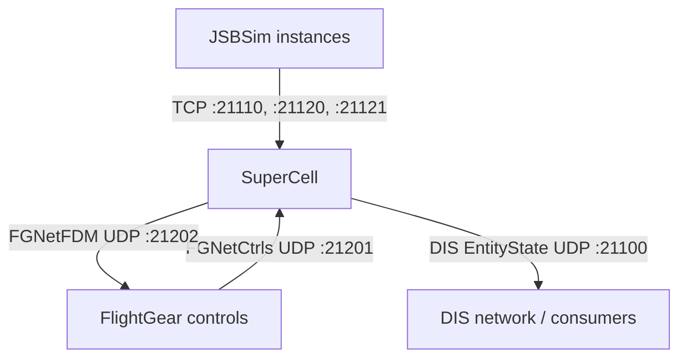

# SuperCell

[](https://gitlab.com/open-arsenal/ams-gra/hello-world-sk/sim/supercell/-/releases)
[](https://gitlab.com/open-arsenal/ams-gra/hello-world-sk/sim/supercell/-/pipelines)
[](https://opensource.org/licenses/Apache-2.0)

> Supercell is a Rust-based simulation controller that drives JSBSim flight dynamics models over TCP and publishes entity state to the DIS network over UDP multicast.

## Table of Contents
- [Features](#features)
- [Prerequisites](#prerequisites)
- [Installation](#installation)
- [Configuration](#configuration)
- [Basic Usage](#basic-usage)
- [Advanced Usage](#advanced-usage)
- [Architecture](#architecture)
- [Contributing](#contributing)
- [License](#license)

## Features

- Steps entities at a configurable tick rate
- Supports fixed (waypoint-following) and JSBSim-backed flight dynamics
- Publishes DIS `EntityState` PDUs over UDP multicast
- Configurable exercise ID, multicast address, and port
- Coordinate pipeline from geodetic to DIS ECEF with Euler orientation
- Optional FlightGear bridge for cockpit visualization and manual flight control

## Prerequisites

- Rust Toolchain (matching `rust-toolchain.toml`)
- Podman (for containerized execution)
- Sleet dependencies (requires checking out the `sleet` repository in `sleet/` or providing an override via `Cargo.toml`)
- *Optional*: Python 3.11+ is needed only if using the debugging scripts in `scripts/`.

## Installation

```bash
git clone https://gitlab.com/open-arsenal/ams-gra/hello-world-sk/sim/supercell.git
cd supercell
```

## Configuration

SuperCell is configured with a TOML file passed via `--config <path>`. The default scenario is at `config/default.toml`. 

See [docs/configuration.md](docs/configuration.md) for full configuration details.

## Basic Usage

The recommended approach is using Podman Compose to start the default scenario (1 blue ownship and 2 red bandits). 

If you are pulling pre-built images from a registry, ensure you are logged in first (replace `registry.gitlab.com` with your actual registry):

```bash
podman login registry.gitlab.com
podman-compose up -d
```

If you are not pulling from the remote registry and need to build the images locally instead, please see the [Building Container Images](docs/building-images.md) guide or use the build overlay:

```bash
make compose-build-up
```

**Expected Output:**

```text
2026-05-01T12:00:00.000000Z  INFO supercell: DIS publisher bound multicast_addr=239.1.2.3 port=21100
```

## Advanced Usage

To run directly from source and build locally in your host environment, you must first clone the `sleet` dependency into the project directory:

```bash
git clone https://gitlab.com/open-arsenal/ams-gra/hello-world-sk/infra/sleet.git sleet
make host-build
make host-test-fast
make host-check-fast
cargo run -- --config config/default.toml
```

Alternatively, to build and run using the development container (which mounts your source code and rebuilds inside the container without requiring local host dependencies):

```bash
make compose-dev-up
```

Note: If you run SuperCell via a container (e.g. `podman run`), `--network host` is required for DIS multicast transmission.

See the `docs/` folder for deeper architectural and reference details such as:
- [Design decisions](docs/decisions.md)
- [DIS EntityState reference](docs/dis-entity-state-pdu.md)
- [Coordinate pipeline](docs/coordinate-pipeline.md)
- [JSBSim ↔ FGNetFDM mapping](docs/jsbsim-fdm-mapping.md)

## Architecture



See [docs/architecture.md](docs/architecture.md) for component and data-flow details, and [docs/contracts.md](docs/contracts.md) for transport/interface contracts.

## Contributing

Contributions are welcome! Please see our [CONTRIBUTING.md](CONTRIBUTING.md) for the full development workflow, MR requirements, and release process.

## License

This project is licensed under the Apache License 2.0 - see the [LICENSE](LICENSE) and [INTENT.md](INTENT.md) files for details.

Third-party Rust crate licenses are audited in CI via `cargo deny`. The generated `THIRD_PARTY_LICENSES.html` is produced as a CI artifact and included in release bundles; it is not committed to this repository. Non-crate dependencies (e.g., [JSBSim](https://github.com/JSBSim-Team/jsbsim)) are tracked in `LICENSES/` with their license text and provenance.
