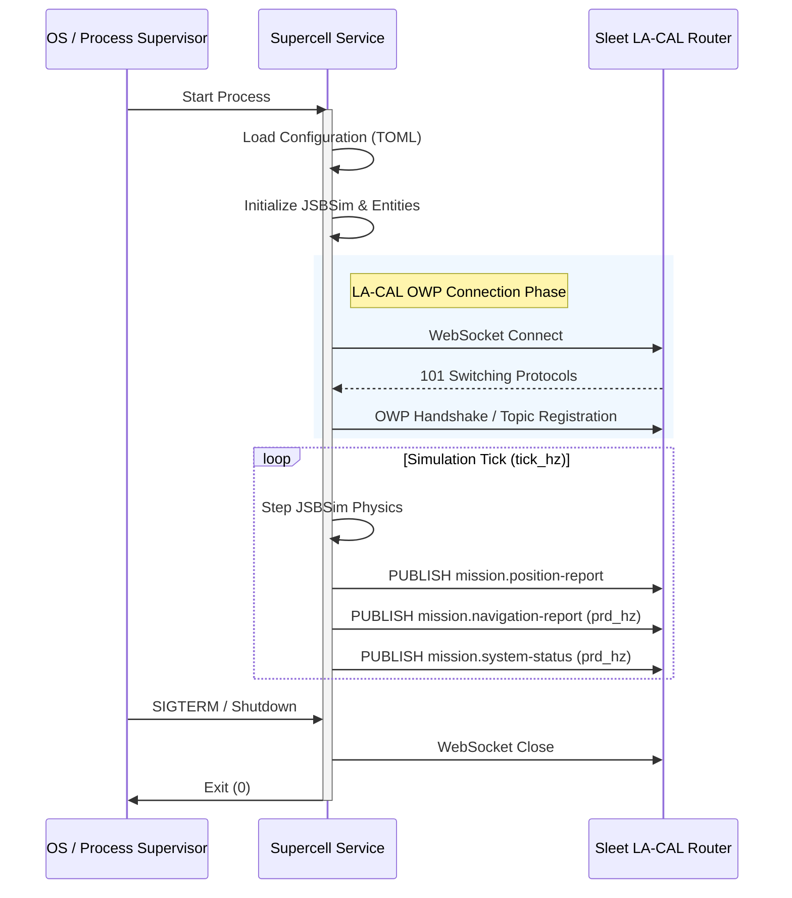

# OMS Service Contract: Supercell

## 1. Scope
**Identification**: Supercell Core Simulation Service
**Version**: 1.0.0
**OMS Standard Version**: v2.5

This document defines the service contract for Supercell in accordance with OMS v2.5 (`14_1_OMSC-TMP-003_RevM_ServiceContractTemplate_DandD_v2_5.docx`).

## 2. Applicable Documents
* Open Mission Systems (OMS) Standard v2.5 (OMSC-STD-001)
* Universal Command and Control Interface (UCI) Standard v2.5

## 3. Service Identification
* **Service Name**: Supercell Simulation Service
* **Service Vendor**: Supercell Project
* **Service Class**: Core Simulation

## 4. Interfaces

### 4.1. Lifecycle & OS Facade
Supercell complies with the OMS Critical Abstraction Layer (CAL) and OS Facade specifications for service lifecycle management.

* **Startup/Shutdown**: Managed via process lifecycle; connects to Sleet LA-CAL OWP WebSocket on startup.
* **Health Monitoring**: Periodically publishes `SystemStatus` messages.

#### LA-CAL Interaction Sequence

### 4.2. Messages Consumed (Inputs)
* `FGNetCtrls` - Optional UDP input for manual flight control override from FlightGear.
* Scenario Configuration (TOML) - Defines static and moving entities, waypoints, and simulation parameters.
* (Does not consume UCI messages directly; behavior driven by config file and internal JSBSim step)

### 4.3. Messages Produced (Outputs)
* `SystemStatus` (UCI) - Periodic health and state reporting over LA-CAL.
* `PositionReport` (UCI) - Publishes simulated entity kinematics over LA-CAL.
* `NavigationReport` (UCI) - Publishes navigation subsystem status and capability over LA-CAL.
* `RoutePlan` (UCI) - Publishes active mission waypoint sequences over LA-CAL.

## 5. Security & Isolation
Supercell operates within the standard OMS mission package security boundary. Outbound UCI messages are marked Unclassified (U) and USA. These security markings (`classification` and `owner_producer`) are exposed as configuration items to change.

## 6. Service Parameters
* `tick_hz`: Simulation tick rate in Hz.
* `log_level`: Log level filter (e.g., `"supercell=info"`).
* `settle_secs`: Suppresses AP/FCS control writes during startup settle phase.
* `waypoint_threshold_m`: Waypoint arrival sphere radius in metres.
* `geoid_undulation_m`: Geoid undulation offset in metres.
* `oms.la-cal.ws_url`: WebSocket URL for the Sleet LA-CAL OWP endpoint.
* `oms.la-cal.system_uuid`: UCI `SystemID` UUID for the ownship entity.
* `oms.la-cal.subsystem_uuid`: UCI `SubsystemID` UUID for the ownship entity.
* `oms.la-cal.position_hz`: PositionReport publish rate in Hz.
* `oms.la-cal.prd_hz`: Periodic reporting rate in Hz (e.g. `SystemStatus`, `NavigationReport`).
